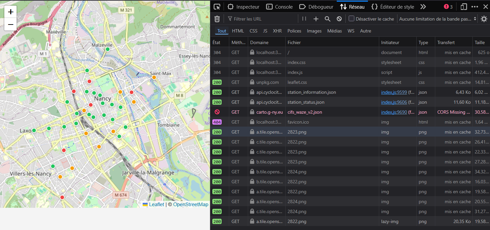
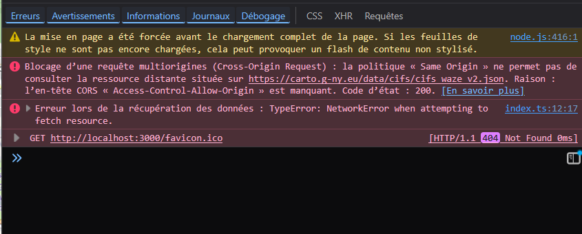

# Explication rapide des données bloquées (CORS / Cross-Origin)

Quand le sujet parle de données bloquées, il fait référence à ce genre d'erreur qui apparaît dans la console du navigateur quand on essaie de faire une requête fetch vers une ressource qui n'autorise pas les requêtes cross-origin (CORS). On testait d'abord depuis notre navigateur directement en tapant l'URL de l'API Waze (qui est justement une API qui renvoie des données bloquées), mais on n'obtenait aucune erreur, en réalité, après de la documentation et un peu plus de compréhension des erreurs CORS, on s'est rendu compte que les erreurs CORS ne se produisent que lorsqu'on fait des requêtes depuis du code JavaScript (comme un fetch) et pas simplement en accédant à l'URL dans le navigateur. Donc pour voir ces erreurs, il fallait faire un fetch vers cette API depuis notre code JavaScript, ce qu'on a fait dans le fichier index.ts du frontend pour tester, et là on a pu voir les fameuses erreurs de données bloquées dans la console du navigateur.

Ces erreurs CORS sont provoquées par le fait que l'API Waze ne permet pas les requêtes cross-origin, ce qui est une mesure de sécurité pour empêcher des sites malveillants d'accéder à des ressources sensibles sur d'autres domaines. C'est donc le navigateur qui bloque la requête en raison des politiques de sécurité CORS, mais c'est l'API Waze qui est configurée pour ne pas autoriser les requêtes cross-origin, ce qui déclenche cette réaction du navigateur. Donc c'est un mécanisme de sécurité mis en place par les navigateurs pour protéger les utilisateurs contre les attaques cross-origin, et c'est l'API Waze qui a choisi de ne pas autoriser ces requêtes, ce qui entraîne ces erreurs de données bloquées lorsqu'on essaie d'y accéder depuis notre frontend.

C'est donc pour ça qu'on va utiliser notre service de données en Java pour faire le fetch vers l'API Waze, car les restrictions CORS ne s'appliquent pas aux requêtes faites depuis le serveur backend, ce qui nous permettra d'obtenir les données de l'API Waze sans être bloqués par les politiques CORS du navigateur. Ensuite, notre frontend pourra faire des requêtes vers notre service Java qui lui, pourra accéder à l'API Waze et récupérer les données sans problème de CORS.

TODO : à confirmer avec Ambroise :
Donc client -> service proxy http + client/service RMI -> client/service RMI + client http -> API Waze du traffic puis chemin inverse et ça revient au navigateur.